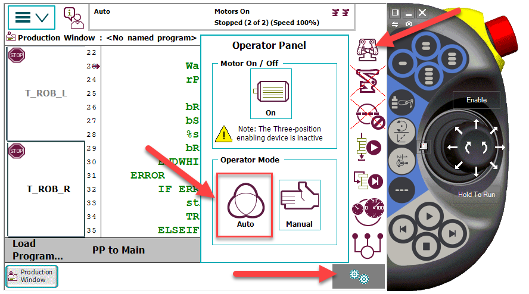
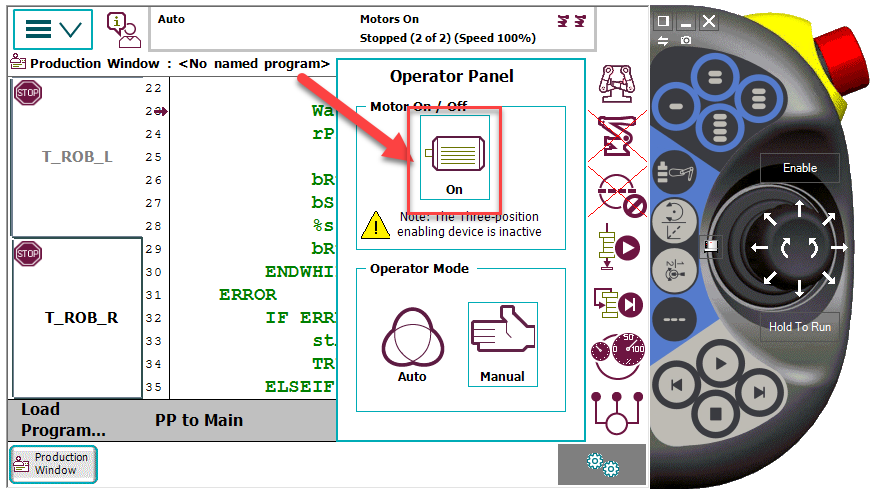
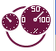

# Getting started with the YuMi.

Take the FlexPendant and set the Program Pointer to main in the Production window.

Change the robot state to automatic mode. Open the quick launch menu by pressing the  Button and open the Operator panel by pressing .

Start the Motor.

Set the robot speed. Open the quick lunch menu by pressing the   Button and open the Speed panel by pressing 

Now press the play button at the FlexPendant.

