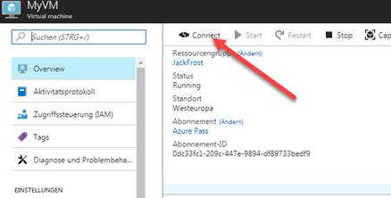

Have a ready-to-use Windows VM with RobotStudio configured to work out of the box! Total manipulation time is around 30 minutes, but mostly waiting (active manipulations are bout 5 min), make sure to start it at the very start of your Hack! 

Follow this few steps to get activated:

* Activate your Azure account by grabbing a free voucher at our booth
* press the button here below, select **West Europe** as a location, pick a **login** and a **password** for your machine and input **any** name as ressource group, other parameters should not be touched. Then accept the conditions and press ok.

* Wait c.a. 20 minutes for the VM to install RobotStudio and perform all configuration steps (it will download and install the full ABB robotics suite). The deployment will be marked as 'failed' but it will work anyway. 
* You don't need to wait to finish the deployment you can log in to the machine by pressing on the left *resource group*->*[your RG name]*->Select the VM->Press connect) *as shown below*. This will download a RDP file that you can use to remote in your machine.

* All the required files for the next steps are located on C:\Windows\Temp\HackZurich
* Double click on the HackZurich.rspag file to extract the robot archive. It will ask you for a license key, input the following one: 2C3JJ-RZPD7-LYFE3-V2S87-L5AFD . Wait until it finish and save the the robot. 
* Close RobotStudio
* Edit the file vcconf.xml and insert your current IP adress. use [This](https://whatismyipaddress.com/)
* Copy the file to C:\Users\[Your User Name]]\AppData\Roaming\ABB Industrial IT\Robotics IT\RobVC 
* Start RobotStudio again (the Station is saved in the recent tab)
* from your local computer go to http://[IP adress of the VM]/rw, log in with credentials "Default User" / "robotics" (without "), if you see a list of dots on the screen you are good to go! If you see a RAPI error come to see us on the booth

**SHOULD YOU HAVE PROBLEMS, PLEASE FEEL FREE TO DROP BY THE BOOTH**